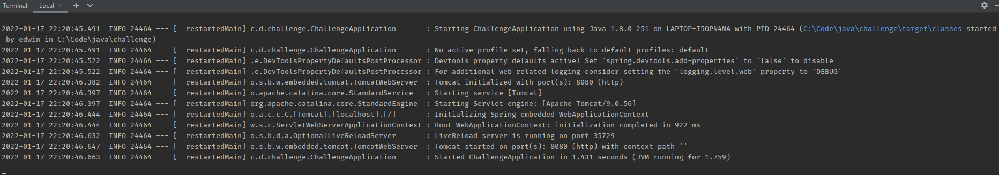
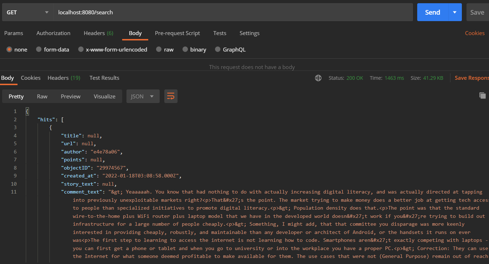

# Getting Started

### Ejecucion

Para correr la aplicacion, ejecutar el comando

```shell
./mvnw spring-boot:run
```



### Prueba

Para probar el endpoint, ejecutar desde Postman una Peticion **GET** a la URL
**localhost:8080/search** una vez la aplicacion haya sido ejecutada.



